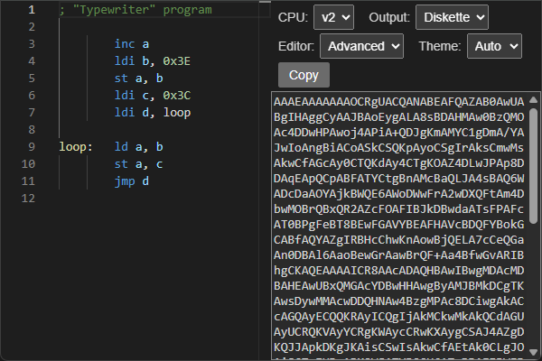

#  Компилятор стрелочек

&nbsp;&nbsp;&nbsp;
🌐 [English](../README.md) | Русский

Этот онлайн-компилятор собирает программы для
[двух компьютеров](https://github.com/chubrik/LogicArrows/blob/main/ru/README.md), построенных в
«Стрелочках» — браузерной игре, где из простых стрелочек на клеточном поле строятся сложные
логические схемы. В левой части он принимает ассемблер, а в правой преобразует его в код сохранения,
который можно вставить на карту с компьютером и запустить.
  

## [Открыть компилятор ⇾](https://chubrik.github.io/arrows-compiler/)

  

## Ссылки

- [Компьютер v2](https://github.com/chubrik/LogicArrows/blob/main/ru/computer-v2/README.md) –
  документация, ассемблер и примеры программ
- [Компьютер v1](https://github.com/chubrik/LogicArrows/blob/main/ru/computer-v1/README.md) –
  документация, ассемблер и примеры программ
- [Стрелочки](https://logic-arrows.io/) – официальный сайт игры
  

Автор выражает благодарность разработчику [GulgDev](https://github.com/GulgDev) за создание
компилятора первой версии.
